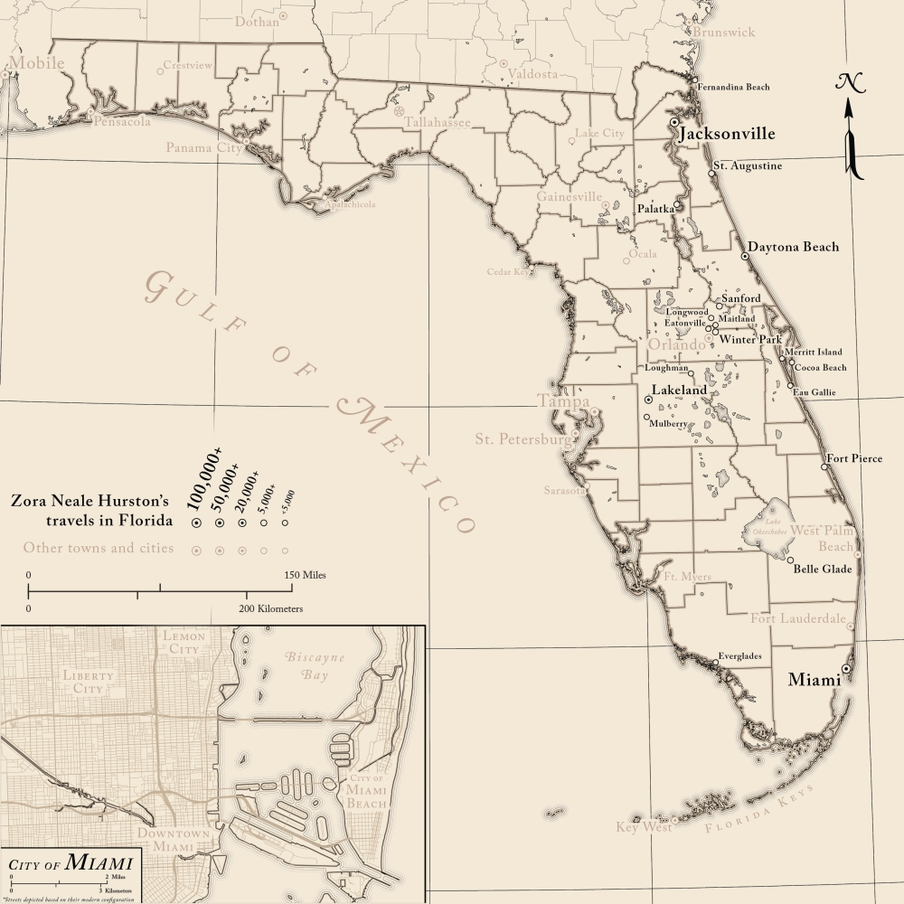

# Welcome to my cartography portfolio!

Please feel free to browse and explore some of the maps I've created or contributed to.

---

	

		
		

			
<a href="portfolio/alabama">Alabama: Its Landforms and Natural Features</a>

		

	

	

		
		

			
<a href="portfolio/bankhead">Rivers of North America</a>

		

	

	

		
		

			
<a href="portfolio/bankhead">The Bankhead Family</a>

		

	

	

		
		

			
<a href="portfolio/selmatoclaiborne">From Selma to Claiborne</a>

		

	

	

		
		

			
<a href="portfolio/tibesti">The Tibesti Mountains</a>

		

	

	

		
		

			
<a href="portfolio/na_physioregions">Physiographic Regions of North America</a>

		

	

	

		
		

			
<a href="portfolio/olympusmons">Olympus Mons</a>

		

	

	

		
		

			
<a href="portfolio/stclairco">St. Clair County, Alabama</a>

		

	

	

		
		

			
<a href="portfolio/almisc">Alabama Miscellany</a>

		

	

	

		
		

			
<a href="portfolio/florida_znh">Zora Neale Hurston in Florida</a>

		

	

	

		
		

			
<a href="portfolio/ww1">On the Point in the Argonne</a>

		

	

	

		
		

			
<a href="portfolio/watermills">Historic Watermills of North America</a>

		

	

	

		
		

			
<a href="portfolio/hispaniola">Spanish Hispaniola</a>

		

	

