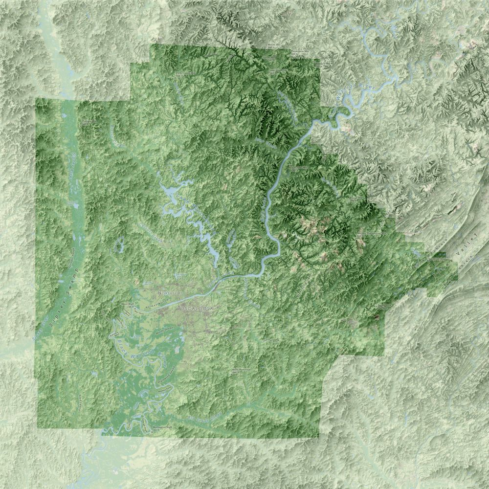
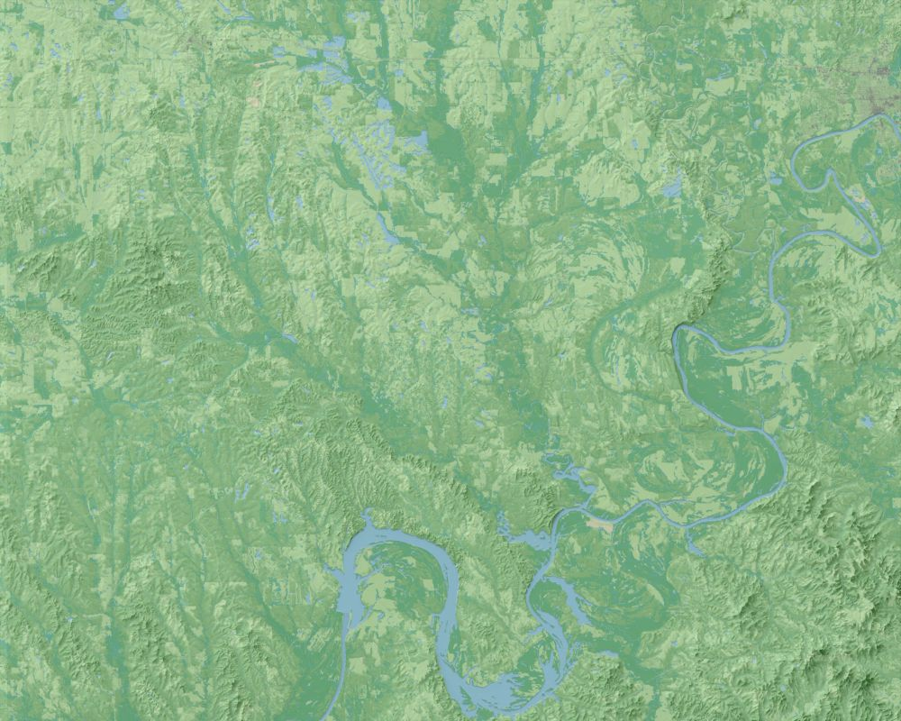

# Alabama Miscellany
---

Not long after I returned from the annual meeting of the North American Cartographic Information Society in Norfolk, VA, a couple came to our lab asking us to make a custom map of Tuscaloosa County. After stumbling across an older draft of my map of Alabama lying near my desk, their request evolved to have the county depicted in more or less the same manner that I had made the Alabama map. The first image was the result: a stylistic twin to the map I'd brought to NACIS, only one that depicted its subject at a much larger scale and thus let me experiment with belding land cover data with a hillshade created from a finer-resolution DEM. 

The other image shows another map I made shortly after NACIS 2018, this time for a group of geographers, historians, and archaeologists who have spent many years trying to uncover the location of Mabila, the fortified community where Hernando de Soto fought and defeated the forces of Chief Tuskaloosa during de Soto's 1839-1842 expedition through what eventually became the Southeastern United States. The map was meant to highlight areas where topographically-significant bluffs might be found along this area of the Black Belt that straddles the Alabama River, though the same technique I'd used to make the maps of Alabama and Tuscaloosa County also let me highlight and emphasize the clear influence that the river and its tributaties have had on the landscape over time. For the map, I also experimented with making the terrain feel a bit more wispy and paintstroke-esque, and in that regard I was quite happy with the final map.