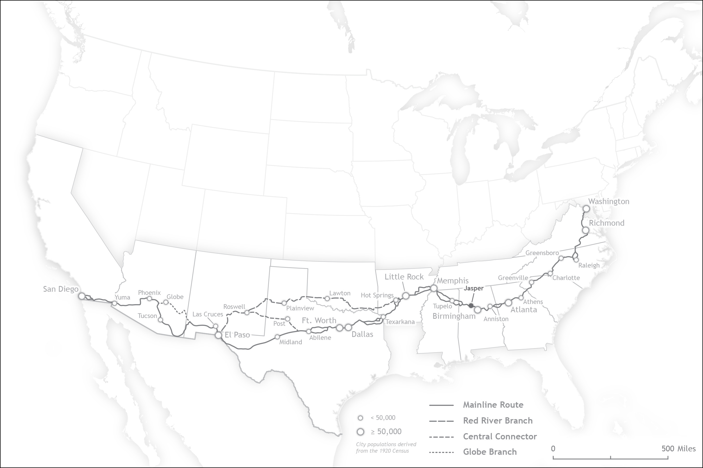

# Alabama's Bankhead Family
---

!!! warning "Construction Zone Ahead!"
	Apologies for the mess! This site is currently under construction.

This past summer, our lab was tasked with making a series of maps of maps for an upcoming book about the Bankheads, a family from Alabama that for three generations ranked among the most prominent families in all of the United States. Members of this family included the family patriarch, John H. Bankhead, who was a captain in the Confederate Army before representing the state of Alabama in both the House of Representatives and the Senate; John's son, William B. Bankhead, whose own prominent career in the House of Representatives eventually culminated in him serving as Speaker of the House between 1936 and 1940; and William's daughter, Tallulah Bankhead, an actress of critical acclaim on both stage and screen throughout much of the early 20th century.

The maps themselves largely deal with intersections between Alabama history and the history of the Bankhead family. This first map, for example, shows the state as it was in 1820, the year that the Bankhead family first arrived in Alabama from South Carolina. In addition to having to approximate the route of General Andrew Jackson's Military Road, which passed through northwest Alabama on its route between Nashville and New Orleans, this map posed the unique challenge of needing a way to visually distinguish between the official boundaries of the state itself, the boundaries of the four Native American nations that possessed territory in Alabama, and the borders of Alabama's counties in this period, a few of which actually claimed territory in neighboring Mississippi! Major settlements in Alabama at the time (several of which have long since been lost to time) were labeled to provide context, as was the village of Moscow, near which the Bankhead family first settled.

The second map depicts the route of the Bankhead Highway, which was established in 1916 and served as the first transcontinental automobile route to traverse the southern half of the United States. The highway was named for John H. Bankhead, who was often referred to as the "Father of Good Roads" due to his role as one of the first advocated for road construction in the United States. Among the many other towns and cities that could be found along its route, the Bankhead Highway passed through Jasper, Alabama, which was the home of the Bankhead family for many decades.

