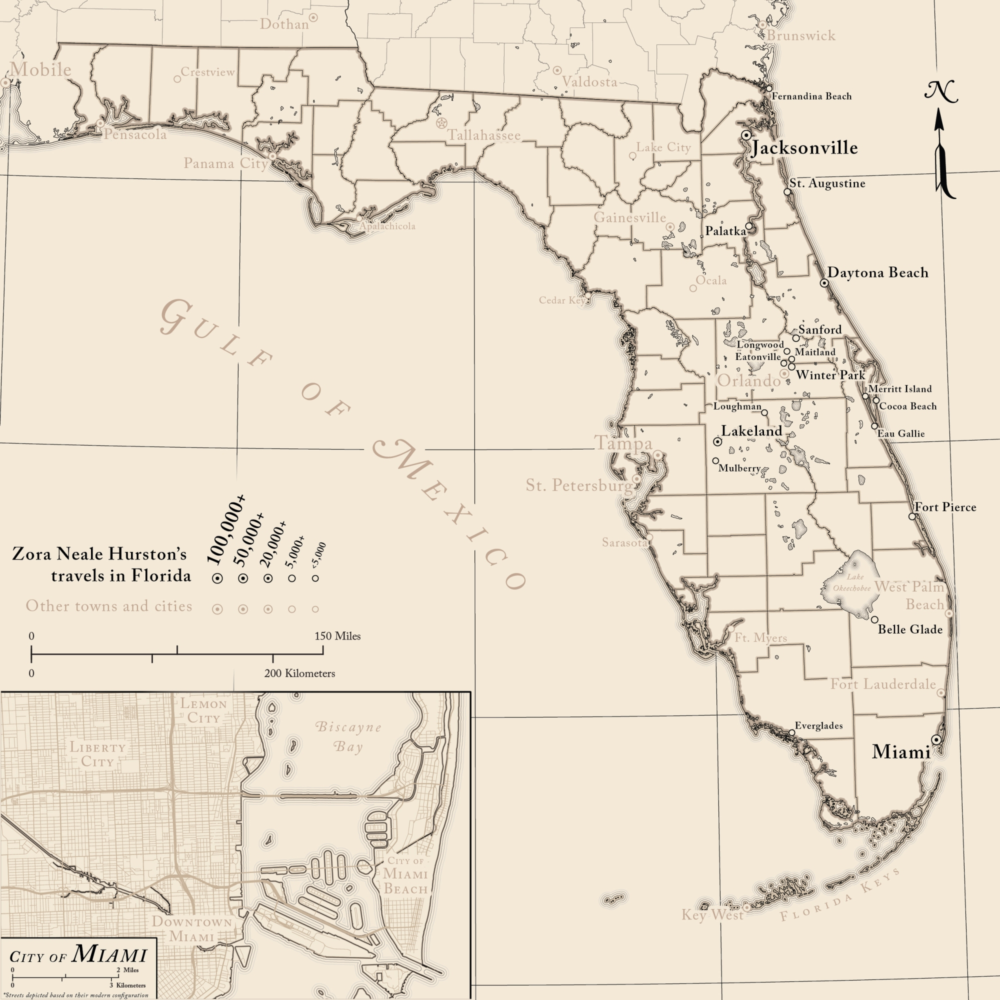

# Zora Neale Hurston in Florida
---

Although the famed author and anthropologist Zora Neale Hurston was born in Notasulga, Alabama, much of her life was spent in neighboring Florida. This map was created for a book detailing Hurston's life in the Sunshine State. Stylistically, it takes inspiration from [a 1921 Rand McNally and Co. map of the state](http://cartweb.geography.ua.edu/lizardtech/iserv/calcrgn?cat=North%20America%20and%20United%20States&item=States/Florida//Florida1921a.sid&wid=1000&hei=900&props=item%28Name,Description%29,cat%28Name,Description%29&style=default/view.xsl&plugin=true), though in an attempt to bridge together the several decades in which she lived in Florida, points representing cities are sized using figures from the 1950 (a decision made in part because a few of the cities that needed to be highlighted, such as Cocoa Beach, did not exist in 1920). 

Coastal vignettes/waterlines are one of my favorite things to make when doing historical mapping, and given the sheer amount of coastline that Florida possesses, it's arguably the perfect place to employ the technique on. Just for fun, I also designed the north arrow based on an artistic flourish that appeared on [a 1941 road map of the state](http://cartweb.geography.ua.edu/lizardtech/iserv/calcrgn?cat=North%20America%20and%20United%20States&item=States/Florida//Florida1941a.sid&wid=1000&hei=900&props=item%28Name,Description%29,cat%28Name,Description%29&style=default/view.xsl&plugin=true).