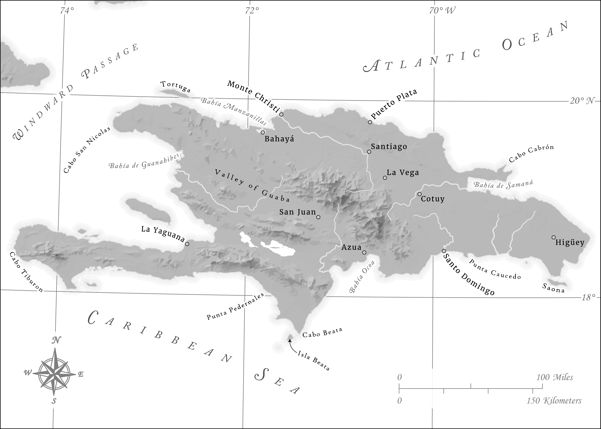

# Spanish Hispaniola
---

In early 2018, I had the opportunity to work on a series of maps meant to complement a book detailing the history of Hispaniola in the early Age of Discovery, during which time Spain alone [possessed full control of the island](https://en.wikipedia.org/wiki/Captaincy_General_of_Santo_Domingo). The maps ultimately employed some of my first attempts at using several different techniques that I now use frequently in my work. It was, for example, one of my first major forays into greyscale mapping, so I did my best to maximize the limited amount of color afforded to me with these maps by utilizing negative space when possible, especially with the representation of rivers on the island. It was also one of my first attempts at making use of curved labels to represent both point and areal features, and it also showcases the first custom north arrow that I'd ever made completely from scratch. Finally, the maps served as the first time I ever implemented hillshade created in Blender (using the fabulous [tutorial](https://somethingaboutmaps.wordpress.com/2017/11/16/creating-shaded-relief-in-blender/) outlined by Daniel Huffman), although for the purposes of these maps the hillshade image was ultimately vectorized to make the maps feel more abstracted and historical.

The first map shown here depicts the island of Hispaniola prior to the [Devastations of Osorio](https://en.wikipedia.org/wiki/Devastations_of_Osorio) in 1605, while the other is a more general map of Spanish possessions in the Caribbean during the same time period.

