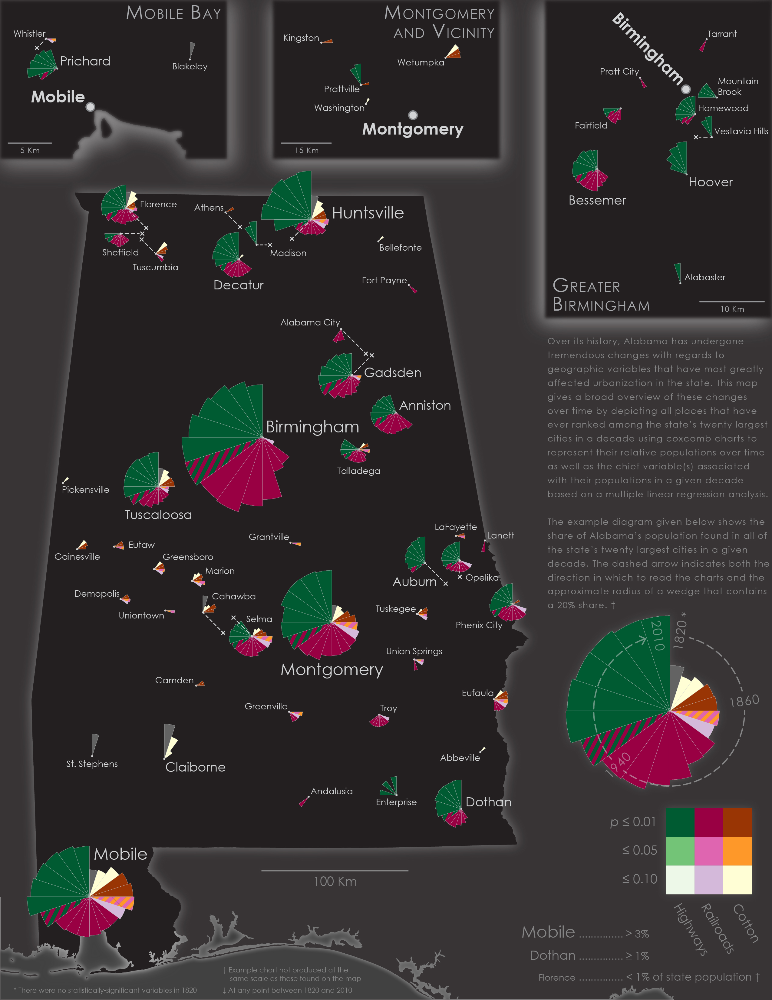

# Visualizing Historical Causes of Urbanization in Alabama
---

It probably goes without saying that urbanization is an incredibly complex process, one that involves a multitude of variables that may very well have nothing in common with one another. That complexity is only magnified when one then decides to examine how these variables and influences have changed over time. Yet I find these variables and the historical changes they exhibit over time to be utterly fascinating. My initial forays into the topic were brought about by a relatively simple interactive map (and indeed, one of my first interactive maps) I made for the UA Cartography Lab's website that showcased the proportional size of Alabama's largest cities over time (which you can view [here](http://alabamamaps.ua.edu/Interactive%20Maps/History/CityPopulations/index.html)). While I'd the map mostly out of my own curiosity of seeing how the sizes of cities in Alabama has changed over time using a visual aid, as time wore on I grew to be more interested in the underlying aspects of the urban population data: *why* did each of these cities grow (or shrink) over time? Were there trends and influences that might have held true across the entire state at given points of time? And was there any sort of spatial relationship between city population and the multitude of geographic factors that can be found in Alabama? 

Although the popular image of Alabama is one of a largely rural nature, my home state turned out to be the perfect case study for this sort of analysis. As trite as it may sound, the state has a remarkably unique set of geographic features that, by chance or by fate, all happen to intersect within a relatively small area. Large swathes of rich soils stretch across portions of the state, which made the state an ideal place for the cultivation of cotton (which, in turn, brough about the tragic, widespread use of slave labor); perhaps the best known of these regions is the prairieland of the Alabama Black Belt, although other regions such as the valleys of the Coosa and Tennessee Rivers also proved to be ideal places for cotton cultivation. Beneath the soil, however, Alabama is also home to large deposits of mineral resources—particularly coal and iron ore—that is scarcely found in the same quantities in other parts of the Southeast, thus creating a combination of natural resources that uniquely positioned the state to become a center of both agriculture and manufacturing. The benefits of such resources, however, are largely nullified if there is no way of cheaply or efficiently transporting these goods to market. Thankfully, Alabama also happens to possess the longest network of commercially-navigable waterways of any state in the nation, thus providing the state with abundant means of transportation in its earliest years. In time, this network would be augmented with man-made connections as well, first via the railroad (which after the Civil War became one of the most expansive of any in the Southeast) and then with highways (especially the limited access routes of the Interstate Highway System). In time, Alabama also became home to a host of tertiary and institutional employers as well, which include military installations (such as Huntsville's Redstone Arsenal and Montgomery's Maxwell Air Force Base), public universities (most notably including the University of Alabama in Tuscaloosa and Auburn University in Auburn); and governmental establishments associated with being a county seat or the state capital. Finally, by the mid-twentieth century suburbanization became a distinct phenomenon in Alabama, as it did in the rest of the United States, whose impact on urbanization cannot be ignored.

Taken together, these factors represent the set of geographic variables that the present academic literature suggests contributed to the growth and development of almost all of Alabama's major cities (defined for this study as the state's twenty largest cities in any given decade). The first task was to compile a list of the twenty largest cities in Alabama in each decade between 1820 and 2010. While this may sound like it involved nothing more than a straightforward trip to the U.S. Census Bureau's website for the data, the reality turned out to be that census records for Alabama in the nineteenth century were quite sparse in the cities that they detailed, as it was often up to the discretion of a county's census taker as to whether or not individual cities within a county would be counted separately or not in the final census return. When towns and cities that, based on other sources of information, were quite large but nevertheless missing from the official census records. it became necessary to turn to other sources (particularly gazeteers and newspaper articles) to come up with population estimates for these missing communities. When even *this* failed to yield a reasonable population figure, I turned to natural cubic spline interpolation as a last-resort means of estimating population for cities where clear and obvious gaps existed between decades where population figures were indeed known. 

I then had to create a series of datasets that could represent the geographic extent of each variable on a decade-by-decade basis. It took many months of poring through various historic maps, atlases, railroad guides, travel accounts, reference books, and academic journals to complete these datasets (the railroad and federal highway datasets proved especially time-consuming to make), but once all of the spatio-temporal data was finally compiled it was thus time to move on to the spatial analysis of each decade's datasets. I ultimately resolved to use a linear regression analysis to discern the relationship between city populations and the spatial independent variables. Each spatial dataset was manipulated in such a way that linear regression could be performed. For each city, population was compared with the total length of railroads and highways (with the value of all Interstate Highway mileages being doubled) within a ten-mile radius of the city; with the presence (or lack) of a navigable waterway within 1.5 miles of the city; with the distance between a city and the nearest region of significant cotton cultivation; with the sum of the distances between a city and the sources of both coal and iron nearest to it; with the sum of a series of weighted scores that were used to represent the possible presence of an "institutional industry" within a given set of radii; and finally with the possible presence of any other cities  within a comfortable commuting distance (as defined by multiple academic sources) that were larger than the target city.

The map on this page ultimately represents a simplified version of the results that came from this analysis. Using coxcomb charts that I produced in R to simultaneously represent a city's population (in proportion to the state's population in a given decade) and the single strongest spatial correlator with city population, I then plotted the charts for each city onto a simple basemap of the state. (I also decided to make the map with base colors of black and dark gray, since I had never previously made a map in this style). The coloring scheme across all of the coxcomb charts is ultimately the same, which I found to be useful when using the map as a way to examine individual cities' populations, both by decade and over time, against the overall trends in urban population influences on a statewide level. Wedges, which were only included on charts in decades that a city was among the state's twenty largest, were assigned using qualitative sequential color scheme based on palettes from ColorBrewer. Inset maps were provided for three major cities in Alabama where their relatively large coxcomb wedges made it impossible to cleanly place their suburbs on the main map. 

In many ways, this map was an experiment of sorts, one in which I attempted to use a static map to display an extremely complex historical topic (and one that would arguably be better suited for a web-based format). I'll be the first to admit that the map certainly has its shortfalls. For example, it displays only the the top predictive variable in each wedge (with rare exceptions occuring in 1870 and 1950, two "transition" decades in which the variables sharing each wedge had essentially the same *p*-value); there is distinct lack of other variables—river access (which mostly appeared as a variable in the antebellum period, but also quite curiously during the early 20th century), mineral resources (a strong second-place variable in the late nineteenth and early twentieth century), and the combination of institutional industries and suburbanization (which switched places as the second- and third-strongest variables from the mid-late twentieth century on)—that did show up in each of the statistical models I produced, but were ultimately left off because of the difficulties I had in finding a way to best display multiple variables within each wedge without also making the graphs difficult to interpret. For the sake of maintaining the map's clarity, I also did not display any of the independent variables as separate base layers, a decision that was in part informed by the temporal nature of each data layer as well.

Despite these shortcomings, I am still quite happy with the end result. The trends that have affected cities individually can be clearly seen on many charts, such as the explosive growth of Birmingham at the beginning of the railroad era and the subsequent decline it experienced as rail transportation (and the heavy industry that relied on it) was replaced by highway transportation. Additionally, the map also proved effective at showcasing spatial relationships that underlie many of the temporal relationships that have been discussed, such as the proliferation of small urban centers that strongly corresponds with the Black Belt region that, in turn, eventually cease to be major urban centers once the railroad becomes the primary economic engine of the state. Finally, and more generally speaking, since I am normally making either reference maps or historical maps, having the ability to practive my skills with producing a map that also functions as a data visualization tool was great fun. Even with the limits I had to impose on what data to display on the final version, I do believe that this map, while far from perfect, is nevertheless still effective as a means of conveying historical influences on urbanization in Alabama, and that if nothing else it can serve as a valuable springboard from which to initiate further, more nuanced discussion on the history of Alabama and its cities. 