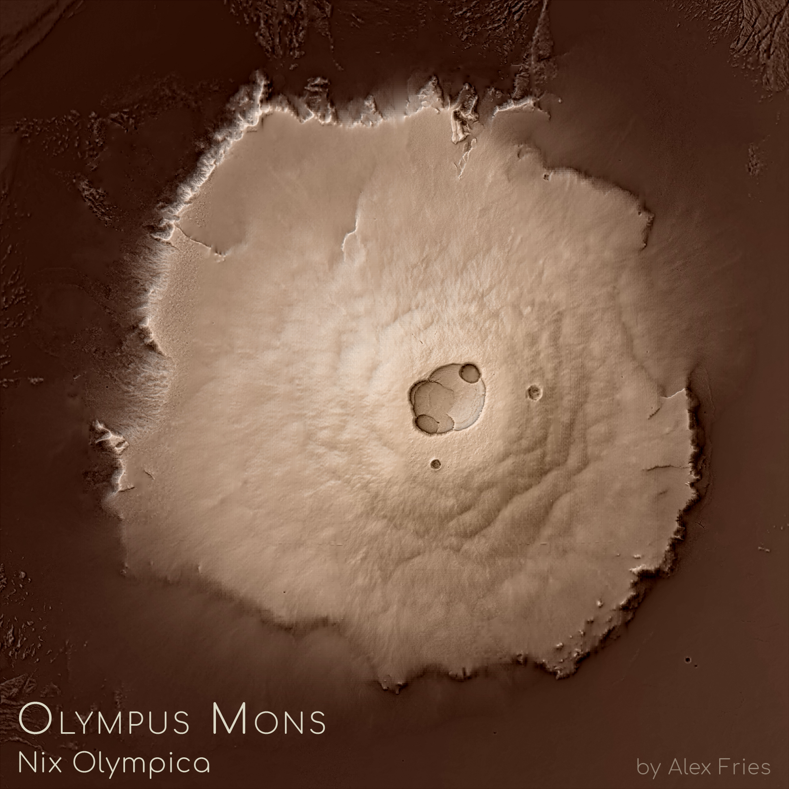

# Olympus Mons
---

The instant that I learned about [NASA's fantastic repository](https://astrogeology.usgs.gov/search?) of digital elevation and GIS data for much of the Solar System, I knew that I needed to make *something* with it. After all, when I was younger, I dreamt of someday being an astronomer, and while my path in life ended up not going down that exact route, all of the data and information that I'd come across here suddenly gave me some sort of way to satisfy that craving for the stars that I've had for as long as I can remember.

The end result was a simple map of a place that's quite familiar to any enthusiast of the Red Planet: Olympus Mons, our Solar System's tallest planetary mountain (although the peak of an impact crater on the asteroid Vesta [might actually be taller...](https://en.wikipedia.org/wiki/Rheasilvia)). I suppose the map is fairly straightforward in and of itself: the hillshade was created in Blender and enhanced with texture shading, and then I cleaned the image up a little bit to remove artifacts and finally gave it a hypsometric tint that I hoped would be able to evoke the sense of it being Martian without it being explicitly red or orange. Making the image, however, did give me a chance to learn more about how to make custom map projections on planets beyond our own, and because I coincidentally started processing the data for this image only hours before NASA announced that [*Opportunity*](https://en.wikipedia.org/wiki/Opportunity_rover) had completed its mission, I also like to consider the map my sort of homage to the little rover that could. 