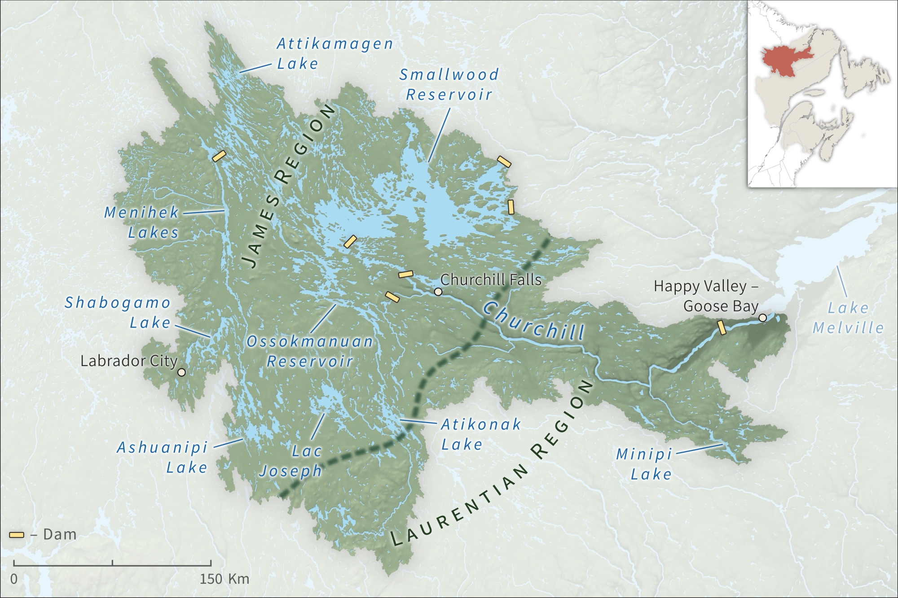
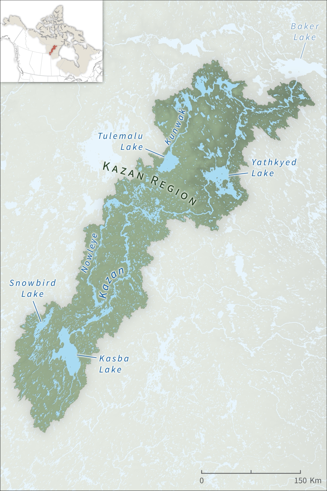

# Physiographic Regions of North America
---

<iframe class="feature_left" width="560" height="315" src="https://www.youtube.com/embed/u56yE70svqI" frameborder="0" allow="accelerometer; autoplay; encrypted-media; gyroscope; picture-in-picture" allowfullscreen></iframe>

My current project at UA's Cartographic Research is working on the maps for the upcoming edition of *Rivers of North America*, a massive reference book that provides in-depth examinations of river systems across North America ([link to the previous edition of the book]). There are approximately two hundred maps to make for the book, and since each map covers individual watersheds that vary significantly in all aspects from size to topographic character, from the outset it became clear to me that this project would require that I make deliberate choices to ensure that the mapmaking process could be streamlined as much as possible.

Given the geographic scope of this job, coming across all of the data needed to make maps spanning from Ellesmere Island to Central America was no easy task. The majority of maps are produced using vector data from the [Global Map initiative](https://globalmaps.github.io/) and [GMTED2010](https://www.usgs.gov/land-resources/eros/coastal-changes-and-impacts/gmted2010?qt-science_support_page_related_con=0#qt-science_support_page_related_con) raster elevation data, since these data sources are seamless and flexible enough to accomodate the mapping of most watersheds featured in the book. Watershed data, meanwhile, was largely acquired from federal and state/provincial repositories in which the watersheds can be found, although for many cases (particularly in the Canadian Arctic and in Central America), it was necessary to manually delineate the watershed boundaries, which was done in QGIS using the hydrological tools found in the excellent (and free!) [Whitebox Tools](https://jblindsay.github.io/ghrg/WhiteboxTools/index.html) suite.

	

		
		

			
<a href="img/RoNA_Churchill.jpg">Churchill River (Labrador)</a>

		

	

	

		
		

			
<a href="../../img/RoNA_Klondike.jpg">Klondike River</a>

		

	

	

		
		

			
<a href="../../img/RoNA_Kazan.jpg">Kazan River</a>

		

	

	

		
		

			
<a href="../../img/RoNA_Nass.jpg">Nass River</a>

		

	

	

		
		

			
<a href="../../img/RoNA_Bow.jpg">Bow River</a>

		

	

	

		
		

			
<a href="../../img/RoNA_Humber.jpg">Humber River (Newfoundland)</a>

		

	

