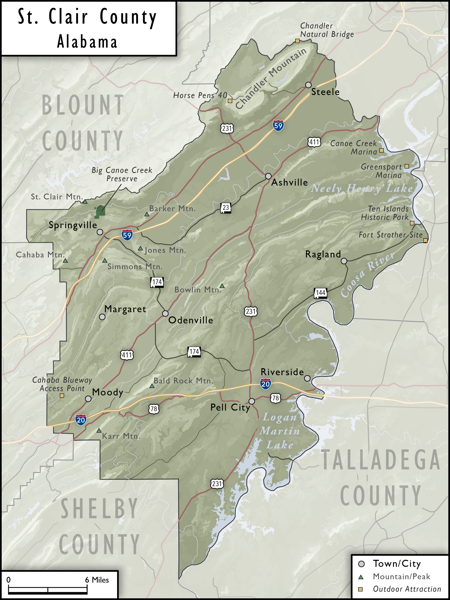

# St. Clair County
---

At the University of Alabama's Cartographic Research Lab, one of our most frequent clients is UA's Center for Economic Development (UACED), who often come to us when they need maps prepared for their frequent meetings with local, municipal, state, and business leaders across Alabama. This map of St. Clair County (found in the eastern part of Greater Birmingham) was developed for one such project that was meant to help highlight the natural features and outdoors attractions of the county, which happens to be found very close to the southern end of the Appalachian Mountains and so has ample opportunities for outdoor recreation. 

What I ended up really liking about this map was that the vectorized relief representation (initially made using Blender and texture shading) ended up looking quite faithful to the original raster datasets while also not being too overwhelming relative to the rest of the map elements. In making the map, I also got the chance to do one of the things I love the most in cartography: researching place names, which was mostly done to find the otherwise-obscure names of mountains and peaks in the county. The map also introduced me to the Chandler Natural Bridge for the first time, a small yet impressive rock bridge that spans a creek on the border of St. Clair and Etowah Counties.