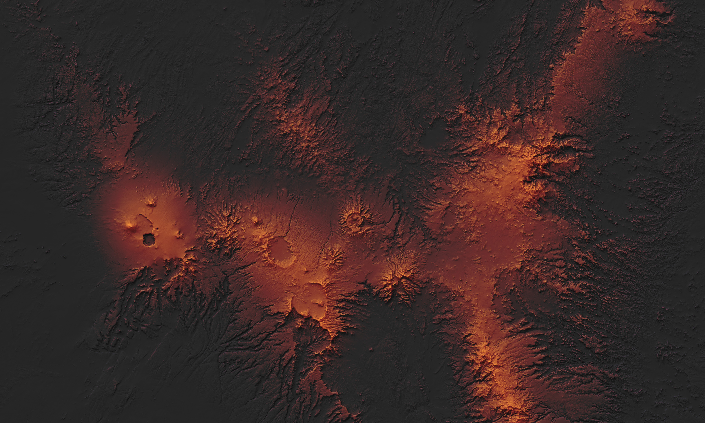

# The Tibesti Mountains
---

In the pre-production phase of my work on the second edition of *Rivers of North America*, much of my time was spent deciding what methods I would employ to create the shaded relief that would go into nearly all of the book's maps. The trick was for me to find a method that was both relatively quick and could give striking, yet clear representations of terrain. Eventually, I came across **Pyramid Shader**, which was developed by Bernhard Jenny and Charles Preppernau during their time at Oregon State University. 

The appeal of Pyramid Shader to me was twofold: first, it's able to create visually appealing shaded relief images quite quickly and efficiently, with the only requirement being an ASCII grid. Secondly, and far more importantly, was the fact that the software is explicitly made to make relief representation more clear by using what's known as Laplacian pyramids to split the terrain into separate scales of detail, ultimately giving more weight to the coarser scales so that larger terrain patterns and landforms aren't drowned out by a landscape's finer details. (If you're interested in learning more about Pyramid Shader, [this blog post by Charles Preppernau](https://geolographer.xyz/blog/2017/2/27/an-introduction-to-pyramid-shader) serves as an excellent introduction and tutorial on the software and how to use it). 

I created the image featured on this page as an initial test run for my future work with the hundreds of river basin maps that I'd eventually have to work on for *Rivers of North America*. For whatever reason, the subject of this first test run was neither riverine or in North America. Instead, I decided to make a quick map of the Tibesti Mountains, a cluster of volcanic peaks and calderas stradling the border of Libya and Chad that had caught my attention a couple of days prior while I was doing some random browsing on Google Earth. The shaded relief was developed using Pyramid Shader and augmented with [texture shading](http://www.textureshading.com/Home.html) from Natural Scene Designer, then combined with a hypsometric tint pallet that I thought did a nice job of accentuating the region's volcanic origins. Ultimately, the image was made as much for fun as for anything else, but it did also ultimately convince me to go forward with using Pyramid Shader once I began making the maps for *Rivers of North America*.