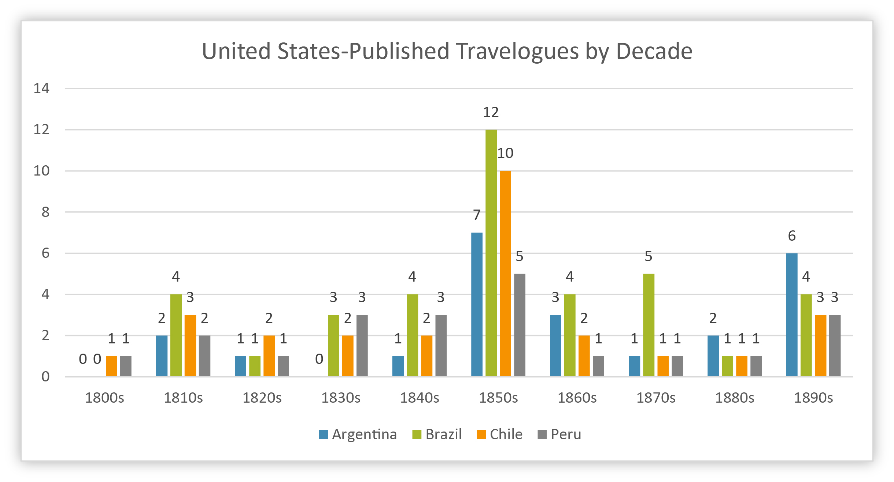

# Perceptions of South America in the Mid-Nineteenth Century United States
---

Long before I learned how to make graphs and charts using tools like R and Python, I made all of my figures using Microsoft Excel. So at a glance, these two graphs probably don't look very special. But in truth, they reveal quite an interesting story that sits right at the intersection of the histories of the United States and South America during the mid-nineteenth century.

	

		
		

			
<a href="img/sagraph01.jpg">English-language travelogue descriptions of South American Nations</a>

		

	

	

		
		

			
<a href="../../img/sagraph02.jpg">Travelogue descriptions of South American Nations published in the United States</a>

		

	

In my final year as an undergraduate at the University of Alabama, I wrote an Honors Thesis for the Department of History under the guidance of the incredible Dr. Teresa Cribelli, a distinguished scholar of Brazil and Latin American history. It naturally followed that my project ended up involving research into South America, and from the outset I found myself interested in how it had been historically perceived in other parts of the world, particularly within my native United States. Of course, South American history spans several centuries, and since the 1830s the continent has been home to a multitude of nations, many of which are Latin America's largest and most populous. I was thus faced with the reality that in order to avoid writing an entire book on the subject, my best bet was to narrow down the scope of my analysis in some manner. Meanwhile, I'd grown a relatively newfound fondness for travel literature from the nineteenth century; I developed an appreciation for their beautiful and, at times, over-the-top descriptions of the peoples, landscapes, societies, and institutions their authors encountered during their travels, and I found them to be equally profound as a tool through which to better understand the attitudes, mindsets, and beliefs of the writers themselves—the good, the bad, and the ugly, alongside all that those things entailed.

It was just my luck that there happened to be a bibliography of English-language travel narratives of South America from the nineteenth century that had previously been compiled by Bernard Naylor in the late 1960s (a snippet view of the text can be accessed on [Google Books](https://www.google.com/books/edition/Accounts_of_Nineteenth_century_South_Ame/2ooLAAAAMAAJ?hl=en&gbpv=0)). Once I got ahold of the bibliography, my goal became to go through each catalogue entry and count the number of times each nation in South America was given a significant description (which I ended up defining as being at least one chapter's worth of descriptive content) across all of the books and narratives that had been recorded. Since my initial intent had also been to explore perceptions of South America as they were in the United States, I also took note of where each travelogue was published, if for no other reason than to represent what publishers in either Great Britain or the United States believed would be content that would be consumed and was therefore worthy of being published. 

I went into this expecting Brazil to be the most frequently-discussed nation across the nineteenth century. However, to my surprise, once I tallied up the raw count of descriptions for all nations, it was actually Argentina that took the top spot, but just barely (it had 112 total appearances across the given travelogues, versus 110 for Brazil). Out of curiosity, I decided to graph out these results out by decade, if for no other reason than to see if there were notable or significant patterns that were otherwise hidden when using just the total sums. Meanwhile, since I'd also tallied the country of publication for each travel narrative, I also figured that it might be worth my while to make the same graph for all narratives published in the United States. 

The results ultimately ended up shaping the course that my entire project took on. The visualization made it immediately clear to me that there was a clear separation between the interests underlying the majority of English-language travelogues (which were British) and the ones published out of the United States. The overall graph highlighted clear spikes in which interest in both travel to and published accounts of South America became more frequent; these roughly appeared to correspond with the end of the Wars of Independence in the former Spanish and Portuguese colonies during the 1820s; the outbreak of the War of the Triple Alliance in the 1860s and the subsequent victory of Brazil, Argentina, and Uruguay over Paraguay in 1870; and the sudden boom in Argentina's economic growth and immigration that took place at the end of the nineteenth century. Comparing the overall graph to the one for the United States alone made it clear that British writings were the driving force behind the spikes. This is not to say that works published in the British Empire wouldn't have also been available for purchase in the United States—and they absolutely were—, but it does at the very least imply that the driving forces that inspired the travelers to take on their journeys, write about them in extensive detail, and publish them in Great Britain would have been more oriented towards the attitudes and interests of the British Empire and its citizens than from those of the United States.

The one spike I neglected to discuss in the last paragraph, which also happened to be the largest spike in publications across the entire dataset, occured in the 1850s—and this one, unlike the other three spikes, appears to have been largely influenced by a surge in travel writings coming out of the United States in that decade. It didn't take long for the correlation to become clear: people began traveling from the eastern seaboard of the United States to seek out their fortunes in the gold fields of nearly-acquired California. There were three routes that these settlers and prospectors tended to use when making their way out west: overland across the wagon trails of the Great Plains and Rocky Mountains; a hybrid sea-land route that involved traversing the rugged Isthmus of Panama; and sailing to San Francisco via Cape Horn. Though rounding Cape Horn was by far the longest of the three options, it also proved to be the safest as well, making it an entirely viable option that many settlers ultimately used to reach California. However, because of both the length and the difficulty of the journey around Cape Horn, ships almost always had to make stops along the way for supplies and repairs. Ultimately, the Brazilian capital of Rio de Janeiro and the Chilean entrepôt of Valparaíso became the chief points for such stops on the Atlantic and Pacific portions, respectively, of the Cape Horn route. Perhaps unsurprisingly, Brazil and Chile emerged from the 1850s as the most frequently-discussed nations in South American travel literature, with the majority of these descriptions ultimately coming out of the United States.

From there, my thesis project began to take shape. It soon evolved into an analysis of how both Brazil and Chile were described and discussed in the print media of the United States during the mid-nineteenth century. My analysis was not strictly limited to examining travelogues—it also examined newspaper accounts, magazine articles, gazetteers, encylopedias, textbooks, maps, and atlases—, but for each country I dedicated the majority of their analyses to a single travel narrative apiece, which were chosen for being texts that exemplified the exemplified the broader attitudes and descriptions that could be found in most accounts published in the United States. (For Brazil, I analyzed the widely-popular [*Brazil and the Brazilians*](https://books.google.com/books/about/BRAZIL_AND_THE_BRAZILIANS_PORTRAYED_IN_H.html?id=IE_22PTGy0IC) (1857) by D.P. Kidder and J.C. Fletcher, while for Chile my primary text was Isaac G. Strain's [*Cordillera and Pampa, Mountain and Plain: Sketches of a Journey in Chili, and the Argentine Provinces, in 1849*](https://books.google.com/books/about/Cordillera_and_Pampa_Mountain_and_Plain.html?id=sl8BAAAAQAAJ), published in 1853). 

As for the results of my textual analysis, I found that on the whole Brazil and Chile received relatively positive descriptions and discussions in the written works of the mid-nineteenth century United States. Writings on both countries spoke highly of their extraordinary natural beauty (especially of the Amazon Basin in Brazil and of the Andes, as well as the Atacama Desert, in Chile). Especially compared to their peers in the rest of Latin America, Brazil and Chile were also positively described for the relative stability and liberalism of their political and governmental institutions; Brazil's constitutional monarchy under Dom Pedro II was held in a high regard by North American writers of the time, as was the republican government of Chile, which itself stood in stark contrast to the frequent turmoil and revolts that the other republics of South America had experienced since acquiring their independence. Each nation was also noted for the bounty of natural resources they possessed, while the writings were also generally complimentary towards the society and culture of the Brazilian and Chilean people. Not all was rosy in these descriptions, of course. Brazil's institution of slavery was seen as reprehensible by writers from the Northern United States, while the peonage system that existed in Chile at the time was likened to feudalism in other writings. The largely-Protestant writers from the United States also held disdain for the predominance of Catholicism in both countries. They also viewed these countries' Latin cultural roots and customs to be inherently inferior to those of the United States and Great Britain alike, while also espousing views and beliefs about the racial and ethnic origins of the Brazilians and Chileans that were abhorrently racist by their very nature. 

Yet despite all of these detractions, I ultimately found the views of North American writers and travelers towards South America to be positive and praiseworthy on the whole, especially when compared to similar accounts and writings on the other nations of South America. As for the project itself, it was ultimately able to take on the form that it did because of the otherwise plain and simple visualizations I created in its earliest stages, visualizations which despite their simplicity were able to shed light on a profound relationship between the happenings of United States history and the opening up of new attitudes and perceptions about its South American neighbors that such events ultimately brought about.