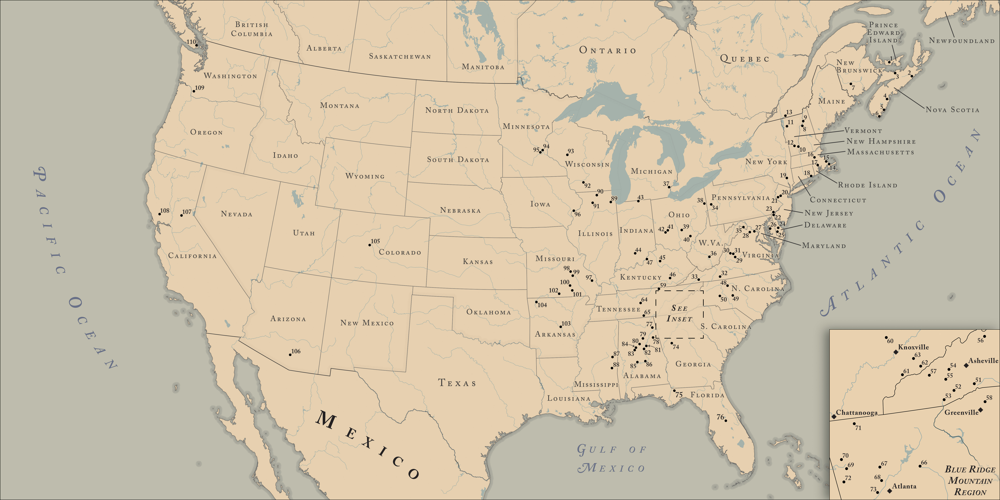

# Historic Watermills of North America
---

This map shows the distribution of varous watermills across the United States and Canada which were featured in a book describing the watermills and their histories. On the surface, it appears to be a relatively simple map, but in fact many of the dots (which indicate particular watermills) could be quite difficult to accurately pinpoint, so much of the fun in making this map came from the quest to simply find those more elusive watermills in the first place!

Originally, the base for this map was a continent-spanning relief and land cover representation of the contiguous United States and southern Canada (see below), though after deliberations with the author it was ultimately decided to go with a simpler,  more historical look, with emphasis being placed on elements such as coastal vignettes and a dominant beige hue across the map to help implement the requested tone. For a while, I also experimented with applying an old paper-esque texture on top of the map to further emphasize its historic feeling, but in the end the author and I agreed to leave the texture off the final map in order for it to retain the clean appearance that had also been requested.

