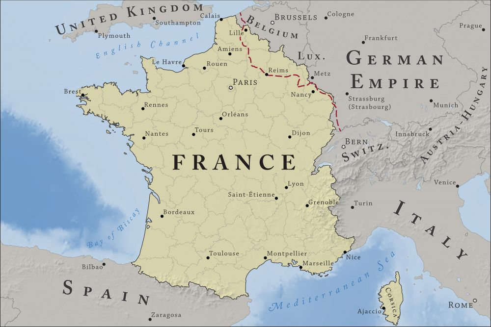
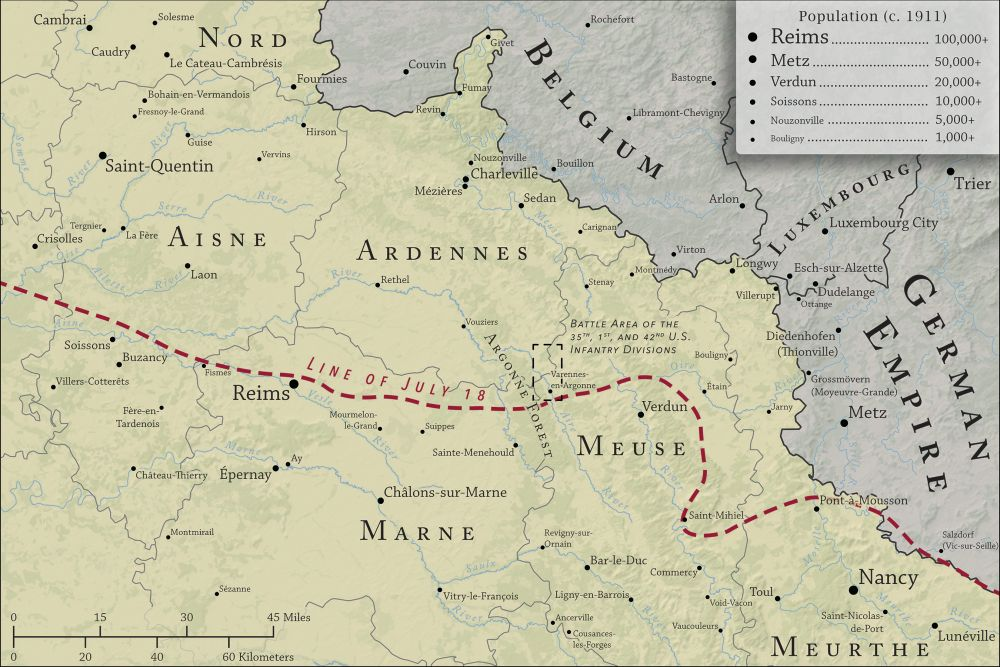
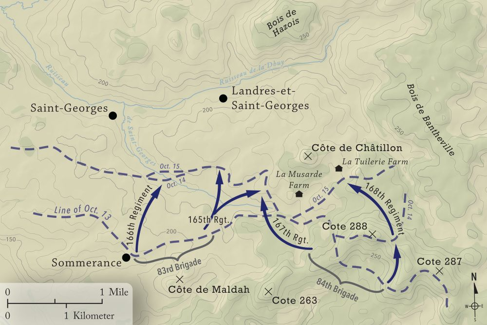
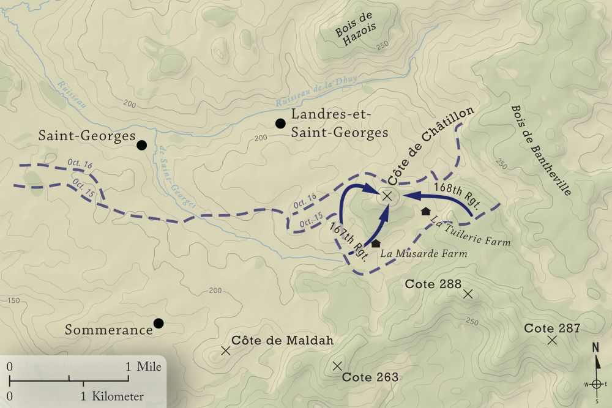

# On the Point in the Argonne
---

	

		
		

			
<a href="img/ww1_france.jpg">France in 1918</a>

		

	

	

		
		

			
<a href="../../img/ww1_ardennes.jpg">Northwest France in 1918</a>

		

	

In the summer of 2018, I had the honor of working on a series of maps that were to be published in a book that detailed the struggles of three United States Army divisions that fought at the height of the Meuse-Argonne Offensive in the final months of World War I. In addition to the general reference maps of France shown here, this project presented me with my first opportunity to make battle maps. The years between the formation of the German Empire in 1871 and the signing of the Treaty of Versailles in 1919 is perhaps my favorite moment in history to learn about (let alone map!), so I found these maps to be an absolute blast to create. 

The reference maps are all my attempt to create as accurate a representation of the conditions in northeastern France as possible during the summer of 1918: special elements found on them include the line of furthest German advance as of July 18, which was extracted from various maps and newspaper accounts from that year; the boundaries of French departments as they would have appeared in that era, largely influenced by the German annexation of Alsace-Lorraine in 1871; and the populations of villages, towns, and cities in the region based on the 1911 Census, many of which were uncovered by diving deep into the French and Luxembourgish(!) versions of Wikipedia. Making the battle maps, meanwhile, ultimately required an intense reading and studying of the book's manuscript to follow and map out the precise troop movements and maneuvers that  American troops  undertook during the pivotal moments of the Meuse-Argonne Offensive. Admittedly, this was the first project in which I'd had to do such a careful reading of the source material itself, but it was a valuable learning experience, and perhaps more importantly, it gave me a far deeper appreciation for the stories and sacrifices I was ultimately mapping out than I may have otherwise received.

	

		
		

			
<a href="img/ww1_oct14-15.jpg">Attack on the Côte de Châtillon - October 14-15</a>

		

	

	

		
		

			
<a href="../../img/ww1_oct16.jpg">Attack on the Côte de Châtillon - October 16</a>

		

	

